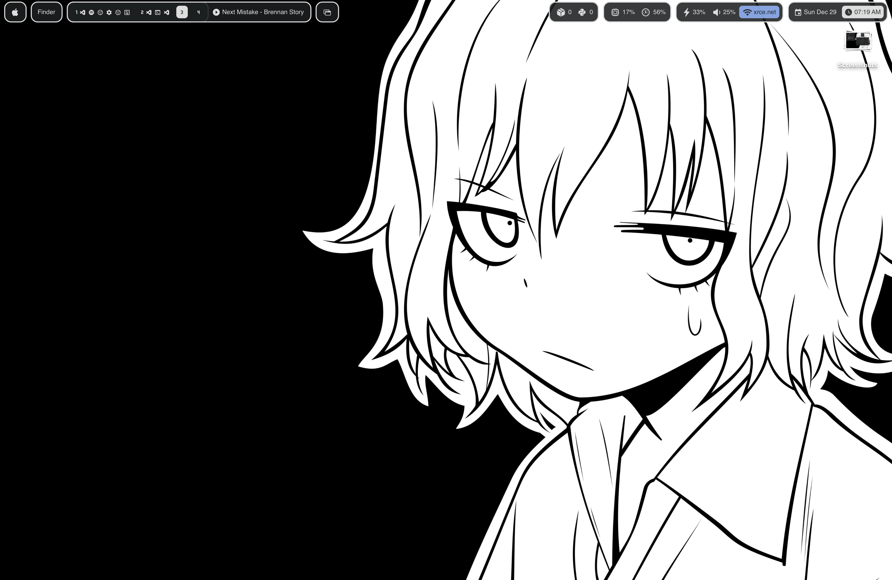
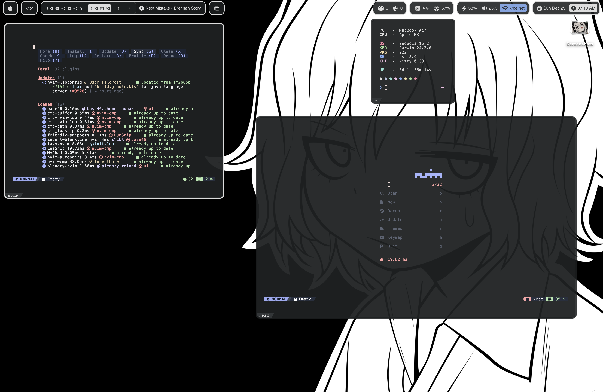

| ```#!/Diane``` | [```mv dots/diane ~/.config/```](./dots/diane/) |
| :-: | :-: |
| **desktop** | **apps** |
|  |  |

| Sketchybar | |
| - | - |
| [```Top bar```](./dots/diane/sketchybar/) | **left:** app icon, app title, spaces |
| | **right:** ```battery```, ```volume```, ```network```, ```privacy indicator``` | 
| [```Bottom bar```](./dots/diane/bottombar/) | **left:** layout, ```media player```, media info |
| | **right:** ```packages```, disk, ```cpu```, ```ram```, ```request```, ```port```, ```process```, date, ```clock``` |
|``` battery ```| colors for each battery level, charging icon |
|``` volume ```| colors for each volume level |
|``` network ```| green for hotspot, blue for wifi, cyan for private, white disconnected |
|``` privacy indicator ``` | colorize only if input is being used |
|``` media player ``` | colors for each player |
|``` packages ```| only show color when there is available updates |
|``` cpu ```| colors for each usage level |
|``` ram ```| colors for each usage level |
|``` request ```| colors for each i/o request |
|``` port ```| colors for each opened port |
|``` process ```| colors for each running processes |
|``` clock ```| colors for each time based on morning, day, noon, and night |

| ```kuujaku.``` | [```mv dots/kuujaku ~/.config/```](./dots/kuujaku/) |
| :-: | :-: |
| **desktop** | **apps** |
|  |  |

| Sketchybar | |
| - | - |
| [```Top bar```](./dots/kuujaku/sketchybar/) | **left:** apple menu, ```app menu```, spaces, ```media player```, layout |
| | **right:** ```packages```, ```cpu```, ```ram```, battery, volume, ```network```, date, clock |
|``` app menu ```| shows app menu if clicked |
|``` media player ``` | colors for each player |
|``` packages ```| only show color when there is available updates |
|``` cpu ```| colors for each usage level |
|``` ram ```| colors for each usage level |
|``` network ```| green for hotspot, blue for wifi, cyan for private, white disconnected |