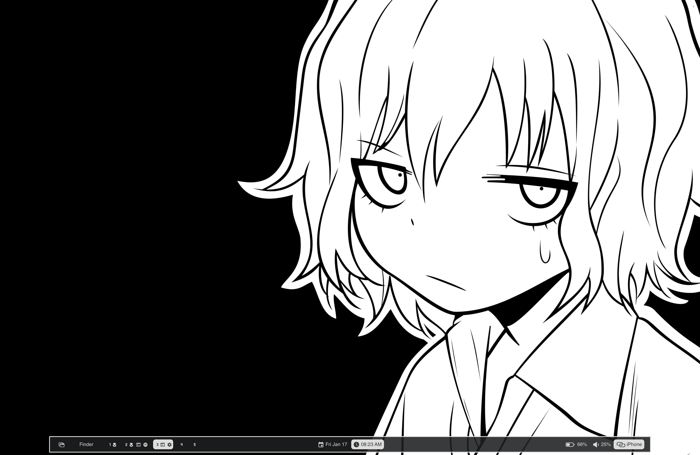

> [!TIP]
> Use ```theme.sh <themename>``` to change theme easily

| ```#!/Diane``` | [```mv dots/diane ~/.config/```](./dots/diane/) |
| :-: | :-: |
| **desktop** | **description** |
|  | Multi panel with a lot of informations, including i/o requests, opened ports, running processes, and privacy indicator |

| ```kuujaku.``` | [```mv dots/kuujaku ~/.config/```](./dots/kuujaku/) |
| :-: | :-: |
| **desktop** | **description** |
|  | Minimal setup with bottom panel showing essential applets |

| ```> geisha <``` | [```mv dots/geisha ~/.config/```](./dots/geisha/) |
| :-: | :-: |
| **desktop** | **description** |
|  | Mac menu bar alternative, showing app name under notch like some of ios apps do |

| ```:nyde``` | [```mv dots/nyde ~/.config/```](./dots/nyde/) |
| :-: | :-: |
| **desktop** | **description** |
|  | Extremely minimal, focused setup, only showing relevant items to improves productivity |
